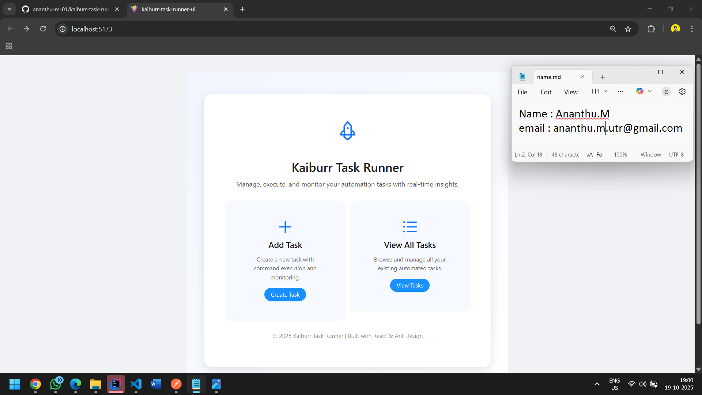
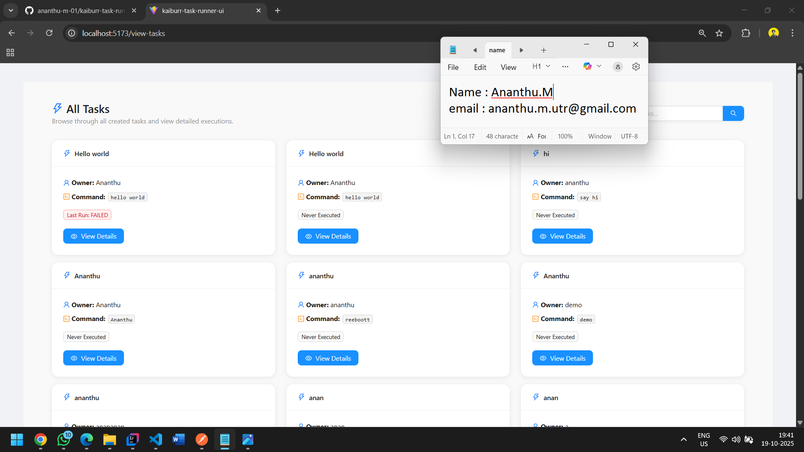
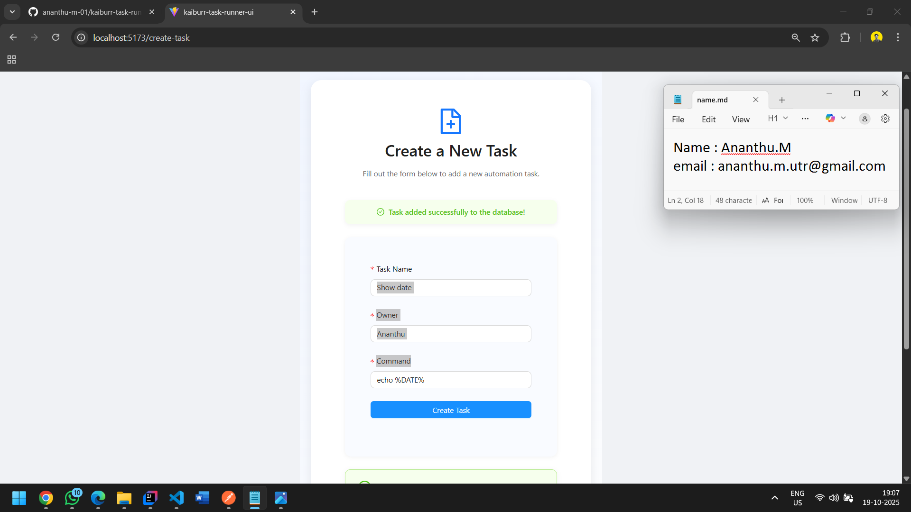
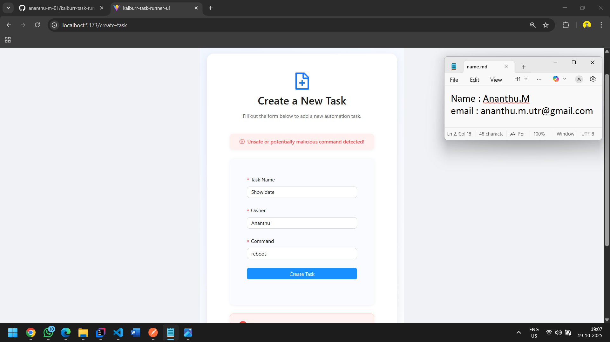
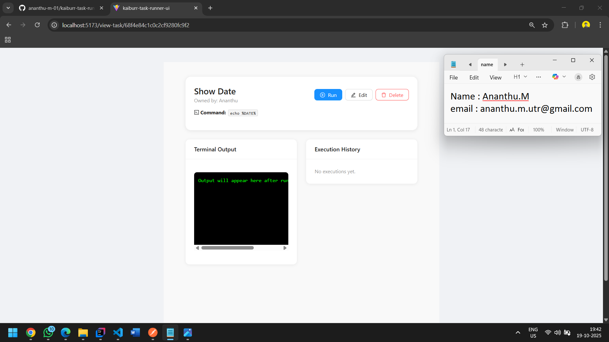
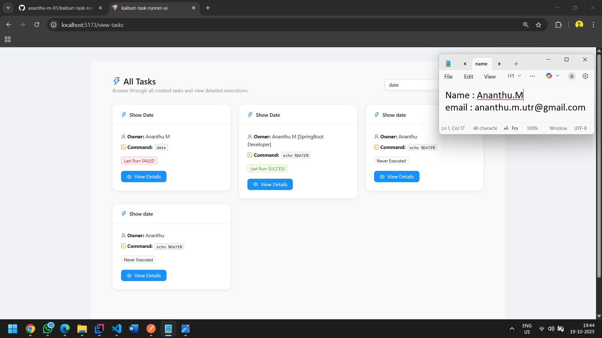
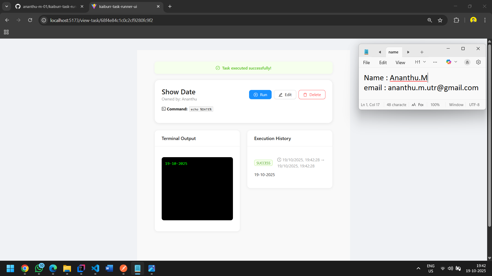
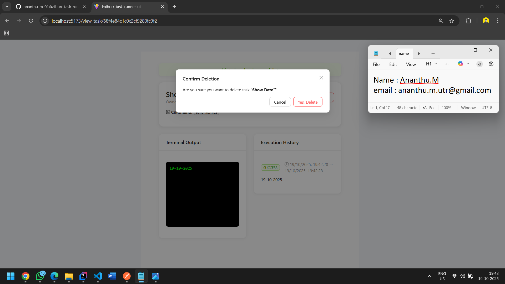

# Task Runner Web UI

A modern, responsive web application built with React 19, TypeScript, and Ant Design for managing and executing tasks through an intuitive user interface.

## Features

- **Create Tasks**: Add new tasks with name, description, and command details
- **View Tasks**: Display all tasks in a clean, organized table format
- **Search Tasks**: Search and filter tasks by name or other attributes
- **Update Tasks**: Edit existing task information
- **Delete Tasks**: Remove tasks from the system
- **Run Tasks**: Execute tasks and view command output in real-time
- **Validation**: Form validation to ensure data integrity
- **Responsive Design**: Optimized for desktop and mobile devices
- **Accessibility**: WCAG compliant with keyboard navigation support

## Technology Stack

- **Framework**: React 19
- **Language**: TypeScript
- **UI Library**: Ant Design (antd)
- **HTTP Client**: Axios
- **Build Tool**: Vite
- **Package Manager**: npm/yarn

## Prerequisites

Before running this application, ensure you have the following installed:

- Node.js (v18 or higher)
- npm or yarn package manager
- Backend API running (from Task #1 or Task #2)

## Installation

1. Clone the repository:
```bash
git clone https://github.com/ananthu-m-01/kaiburr-task-runner-ui.git
cd kaiburr-task-runner-ui
```

2. Install dependencies:
```bash
npm install
```

Or if using yarn:
```bash
yarn install
```

3. Configure the API endpoint:
   - Open the configuration file where the API base URL is defined (e.g., `src/config/api.ts` or environment file)
   - Update the `API_BASE_URL` to point to your backend server
   ```typescript
   export const API_BASE_URL = 'http://localhost:8080/api';
   ```

## Running the Application

### Development Mode

To start the application in development mode with hot-reload:

```bash
npm run dev
```

Or with yarn:
```bash
yarn dev
```

The application will start at `http://localhost:5173` (or the port specified by Vite). Open this URL in your browser to access the application.

### Production Build

To create an optimized production build:

```bash
npm run build
```

Or with yarn:
```bash
yarn build
```

The build output will be generated in the `dist` directory.

### Preview Production Build

To preview the production build locally:

```bash
npm run preview
```

Or with yarn:
```bash
yarn preview
```

## Usage Guide

### 1. Home Page

The landing page provides an overview of the Task Runner application with navigation to all features.



### 2. View All Tasks

The main task list displays all tasks in a paginated table with sorting and filtering capabilities. Users can view task details, edit, delete, or run tasks from this interface.



### 3. Create Task

To create a new task, click the "Create Task" button and fill out the form with the following information:

- **Task Name**: A unique identifier for the task
- **Description**: Detailed information about what the task does
- **Command**: The command to be executed when the task runs



#### Form Validation

The application includes comprehensive form validation to ensure data integrity. Required fields must be filled before submission, and appropriate error messages are displayed.



### 4. View Task Details

Click on any task from the list to view its complete details, including task name, description, command, creation date, and execution history.



### 5. Search Tasks

Use the search functionality to quickly find tasks by entering search criteria. The search supports filtering by task name and other attributes.



### 6. Update Task

To modify an existing task, click the edit button next to the task. This opens a form pre-filled with current task data that can be updated.


### 7. Run Task

Execute tasks directly from the UI by clicking the "Run" button. The application will display the command output in real-time, showing the execution status and results.



### 8. Delete Task

Remove tasks from the system by clicking the delete button. A confirmation dialog appears to prevent accidental deletion, ensuring data safety.



## Project Structure

```
kaiburr-task-runner-ui/
├── src/
│   ├── components/          # Reusable React components
│   │   ├── TaskList.tsx     # Task list display component
│   │   ├── TaskForm.tsx     # Create/edit task form
│   │   ├── TaskDetail.tsx   # Task detail view
│   │   └── ...
│   ├── services/            # API service layer
│   │   └── taskService.ts   # Task-related API calls
│   ├── types/               # TypeScript type definitions
│   │   └── task.ts          # Task interface definitions
│   ├── config/              # Application configuration
│   │   └── api.ts           # API configuration
│   ├── App.tsx              # Main application component
│   └── main.tsx             # Application entry point
├── public/                  # Static assets
├── screenshots/             # Application screenshots for documentation
├── package.json             # Project dependencies and scripts
├── tsconfig.json            # TypeScript configuration
├── vite.config.ts           # Vite build configuration
└── README.md                # Project documentation
```

## User Interface and User Experience Features

### Usability

- **Intuitive Navigation**: Clear menu structure and navigation flow
- **Responsive Layout**: Adapts seamlessly to different screen sizes and devices
- **Loading States**: Visual feedback during API calls to inform users of ongoing operations
- **Error Handling**: User-friendly error messages with actionable guidance
- **Confirmation Dialogs**: Prevent accidental destructive actions with confirmation prompts
- **Toast Notifications**: Immediate feedback for user actions (success, error, warning messages)
- **Table Operations**: Sorting, filtering, and pagination for efficient data management

### Accessibility

- **Keyboard Navigation**: Full keyboard accessibility support for all interactive elements
- **ARIA Labels**: Proper ARIA attributes for screen reader compatibility
- **Focus Management**: Clear focus indicators for keyboard users
- **Semantic HTML**: Proper use of HTML5 semantic elements
- **Color Contrast**: WCAG AA compliant color contrast ratios
- **Form Labels**: Clear and descriptive labels for all form inputs

## API Integration

The application integrates with the backend REST API using the following endpoints:

- **GET** `/api/tasks` - Retrieve all tasks
- **GET** `/api/tasks/{id}` - Retrieve a specific task by ID
- **POST** `/api/tasks` - Create a new task
- **PUT** `/api/tasks/{id}` - Update an existing task
- **DELETE** `/api/tasks/{id}` - Delete a task
- **POST** `/api/tasks/{id}/run` - Execute a task and retrieve output

All API calls are handled through the service layer with proper error handling and loading states.

## Environment Configuration

Create a `.env` file in the root directory to configure environment-specific variables:

```env
VITE_API_BASE_URL=http://localhost:8080/api
```

## Troubleshooting

### Common Issues and Solutions

#### CORS Error

**Problem**: Browser blocks requests to the backend API.

**Solution**: Ensure your backend API has CORS enabled for the frontend origin. Add appropriate CORS headers in your backend configuration.

#### API Connection Failed

**Problem**: Unable to connect to the backend API.

**Solution**: 
- Verify the backend server is running
- Check that `API_BASE_URL` is correctly configured
- Ensure the backend port matches the configured URL

#### Port Already in Use

**Problem**: Development server fails to start due to port conflict.

**Solution**: 
- Stop any other process using the port
- Or change the port in `vite.config.ts`:
```typescript
export default defineConfig({
  server: {
    port: 5173 
  }
})
```

#### Module Not Found

**Problem**: Import errors after cloning the repository.

**Solution**: Delete `node_modules` and reinstall dependencies:
```bash
rm -rf node_modules
npm install
```

## Browser Support

The application is tested and supported on:

- Chrome (latest)
- Firefox (latest)
- Safari (latest)
- Edge (latest)

## Development Notes

### Code Quality

- TypeScript strict mode enabled for type safety
- ESLint configured for code quality
- Component-based architecture for maintainability
- Separation of concerns with service layer

### Best Practices Implemented

- Proper error boundary implementation
- Loading state management
- Optimistic UI updates where appropriate
- Proper cleanup in useEffect hooks
- Memoization for performance optimization

## Submission Information

This project is submitted as part of Task #3 (Web UI Forms) for the Kaiburr technical assessment. 

**Key Requirements Met:**

- Built with React 19, TypeScript, and Ant Design
- Full CRUD operations (Create, Read, Update, Delete)
- Search functionality
- Command execution with output display
- Focus on usability and accessibility
- All screenshots include timestamp and author identification
- Complete documentation in README.md format

## Author

Ananthu M

## Acknowledgments

This application was developed as part of the Kaiburr technical assessment, demonstrating proficiency in modern web development technologies and best practices for building accessible, user-friendly interfaces.